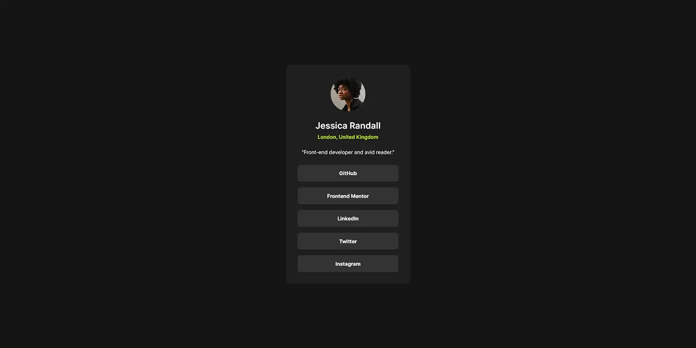

# Frontend Mentor - *Social links profile component* solution

This is my solution to the [Social links profile component challenge](https://www.frontendmentor.io/challenges/social-links-profile-UG32l9m6dQ) on Frontend Mentor.

## Table of contents

- [Overview](#overview)
  - [Screenshot](#screenshot)
  - [Links](#links)
- [My process](#my-process)
  - [Tools](#tools)
  - [Features](#features)

## Overview

### Screenshot

### Links

- Solution URL: <https://www.frontendmentor.io/solutions/social-links-profile-component-GFy0miJz5F>
- Live Site URL: <https://erratic-enigma.github.io/social-links-profile>

## My process

### Tools

- [Vite](https://vitejs.dev)
- [SCSS](https://sass-lang.com)

### Features

- Semantic HTML5 markup
- [RCCSS (Reasonable System for CSS)](https://rstacruz.github.io/rscss)
- CSS custom properties
- Flexbox
- CSS Grid